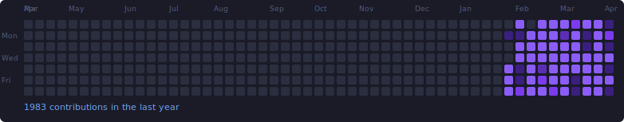

# Hey, I'm Brad Groux 👋 - join my [Discord](https://discord.gg/Gmfkm7QVSF)!

**Co-founder and CEO of [Digital Meld](https://www.digitalmeld.io)**, host of the [Start Small, Think Big](https://www.youtube.com/playlist?list=PLw2ImU79nlNNgAbYOkdMpSPaqYgK2CDLR) podcast, and builder of AI systems that survive contact with real work. If you want to talk shop about agents, automation, and shipping useful things, join my [Discord](https://discord.gg/Gmfkm7QVSF).

<!-- contribution-summary:start -->
<strong>Contribution activity:</strong> 14,104 contributions in the last year. Activity levels use distinct shapes as well as color.
<!-- contribution-summary:end -->

  <picture>
    <source media="(max-width: 600px)" srcset="./contribution-grid-mobile.svg" />
    
  </picture>

<!-- github-stats-summary:start -->
<strong>GitHub stats:</strong> 829 stars · 841 commits in the last year · 590 pull requests · 736 issues · contributions to 10 repositories in the last year.
<!-- github-stats-summary:end -->

  

## What I'm Working On

🦞 **[OpenClaw](https://github.com/openclaw/openclaw)** — Open source AI agent runtime and orchestration platform. I’m the Microsoft maintainer and liaison, focused on Teams and Microsoft ecosystem integrations that make OpenClaw work in the real world.

🛠️ **[OpenClaw Dev Days](https://github.com/BradGroux/openclaw-dev-days)** — Reusable workshop kit for teaching OpenClaw without turning setup into install chaos. Built around fast first wins, facilitator runbooks, setup guides, and reusable labs.

🖊️ **[dm-annotate](https://github.com/BradGroux/dm-annotate)** — Native, local-only macOS screen annotation tool for demos, classes, design reviews, screen shares, and recordings.

🎥 **[dm-lessonmeld](https://github.com/BradGroux/dm-lessonmeld)** — Native, local-first macOS recording suite for curriculum builders. Record, review, render, and package lessons into local project bundles.

🔲 **[Veritas Kanban](https://github.com/BradGroux/veritas-kanban)** — Lightweight project orchestration built for the agentic AI era. 650+ stars, MIT licensed. Think kanban meets AI task delegation — where your board actually knows what's happening.

🧠 **[BrainMeld](https://www.brainmeld.io)** — Knowledge fusion platform. Turning scattered notes, conversations, and research into a connected knowledge graph. Coming soon under Digital Meld.

🤝 **[DealMeld](https://www.dealmeld.io)** — Digital sales room and CRM platform. Streamlining the deal lifecycle from first touch to close.

🚀 **[sstb.ai](https://www.sstb.ai)** — Live community and learning platform extending Start Small, Think Big into courses, memberships, and practical AI education.

🎙️ **[Start Small, Think Big](https://www.digitalmeld.io)** — A podcast about building things that matter, from the messy middle of actually doing it.

## Background

25+ years in enterprise IT. Went from managing infrastructure, to architecting platforms at scale to building AI-powered products and catered solutions. I co-founded **Digital Meld** to help businesses stop drowning in manual processes and start using AI and automation where it actually moves the needle - operations, data pipelines, decision support, and business intelligence.

## Writing & Guides

- **[Use Agents Like a Team, Not a Giant Chat Window](docs/codex-managed-agent-patterns/codex-managed-agent-patterns.md)** — Split judgment, research, and execution without turning the main thread into a junk drawer.
- **[You Don't Have to Wait for Someone Else to Build It](docs/you-dont-have-to-wait-to-build-it/you-dont-have-to-wait-to-build-it.md)** — Start with one painful loop, one signal, and one useful next action.
- **[Browse all writing and practical guides](docs/README.md)** — Find companion guides, research notes, and reusable prompts.

## The Stack

- **Application development:** TypeScript, React, Node.js, Vite, Tailwind, and Python
- **Platforms and operations:** Microsoft Azure, Microsoft 365, Cloudflare, n8n, and Supabase
- **AI systems:** LLMs, coding agents, vision models, and knowledge graphs

## Community

- 💜 Two nonprofits: **The Longhorn Project** @ NASA JSC and **Elijah Rising**
- 🗣️ Speaker on AI for business, agentic workflows, and practical automation

## Connect

---

Built with strong opinions, an unhealthy amount of Tex-Mex and Dr. Pepper Zero, and an unreasonable number of AI agents in Houston, TX.
