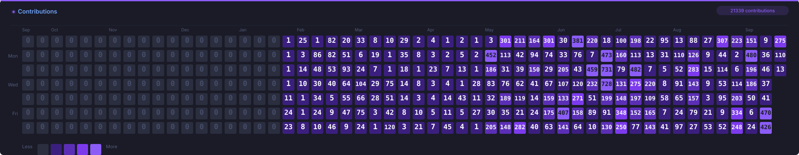

# Hey, I'm Brad Groux 👋 - join my [Discord](https://discord.gg/Gmfkm7QVSF)

**Co-founder and CEO of** [**Digital Meld**](https://www.digitalmeld.io/), host of the [Start Small, Think Big](https://www.youtube.com/playlist?list=PLw2ImU79nlNNgAbYOkdMpSPaqYgK2CDLR) podcast, and builder of AI systems that survive contact with real work. If you want to talk shop about agents, automation, and shipping useful things, join my [Discord](https://discord.gg/Gmfkm7QVSF).

Visit [bradgroux.com](https://bradgroux.com/) to book me for a keynote, workshop, or panel, and see my upcoming appearances at [where.bradgroux.com](https://where.bradgroux.com/).

  

  
  
   

## What I'm Working On

🧭 **[AI-Native Operating Framework](https://github.com/BradGroux/ai-native-operating-framework):** Open business operating framework and method for defining, documenting, applying, and improving the standards and procedures through which people and AI perform work.

🌱 **[Influence Operating Framework](https://github.com/BradGroux/influence-operating-framework):** Open business operating framework for building meaningful influence through useful contribution, trusted relationships, accountable judgment, and continuous learning.

🛠️ **[AI Dev Days](https://github.com/BradGroux/ai-dev-days):** Public research and education companion to the AI-Native Operating Framework, with reusable events, curriculum, labs, and tool-specific tracks.

🔲 **[Veritas Kanban](https://github.com/BradGroux/veritas-kanban):** Local-first task management and orchestration for people working with AI agents, with a visual board plus optional CLI, MCP, workflows, and governance. It now ships as a signed and notarized macOS app, too.

🐝 **[Buzz](https://github.com/block/buzz):** Self-hostable workspace where humans and AI agents build together on a relay you own. I’m a passionate user, evangelist, educator, and contributor.

🧠 **[BrainMeld](https://www.brainmeld.io):** Multi-assistant knowledge orchestration for local workspaces and Obsidian vaults, with validation, review queues, conflict prevention, citation anchors, and audit trails.

🤝 **[DealMeld](https://www.dealmeld.io):** Multi-tenant CRM and digital sales room with deal pipelines, secure collaboration, agent-ready APIs, and AI-assisted company intelligence.

🖊️ **[dm-annotate](https://github.com/BradGroux/dm-annotate):** Native, local-only macOS screen annotation tool for demos, classes, design reviews, screen shares, and recordings.

🎥 **[dm-lessonmeld](https://github.com/BradGroux/dm-lessonmeld):** Native, local-first macOS recording suite for capturing, reviewing, annotating, rendering, and packaging lessons into portable project bundles.

🚀 **[sstb.ai](https://www.sstb.ai):** Public home for the Start Small, Think Big operator community, events, AI Operator Lab, training, and advisory.

🎙️ **[Start Small, Think Big](https://www.youtube.com/playlist?list=PLw2ImU79nlNNgAbYOkdMpSPaqYgK2CDLR):** Conversations with builders and operators about the messy middle of turning ideas into useful systems.

## Background

25+ years in enterprise IT. I went from managing infrastructure to architecting platforms at scale and building AI-powered products and tailored systems. I co-founded **Digital Meld** to help businesses stop drowning in manual processes and use AI and automation where it actually moves the needle: operations, data pipelines, decision support, and business intelligence.

## Past Work

🦞 **[OpenClaw](https://github.com/openclaw/openclaw):** Open-source personal AI assistant and agent runtime. I served as the Microsoft maintainer and liaison, building Teams and Microsoft ecosystem integrations for real-world deployments.

## The Stack

- **Languages:** TypeScript, JavaScript, Python, Swift, Rust, C#/.NET, SQL
- **Applications:** React, Vite, Astro, Mantine, Tailwind CSS, SwiftUI, Electron
- **Cloud and data:** Node.js, Cloudflare Workers/Pages/D1, Supabase/PostgreSQL, Docker
- **Microsoft:** Azure, Microsoft 365/Graph, Power Platform/Dataverse
- **AI systems:** LLMs, agent orchestration, MCP, RAG/knowledge graphs, computer vision

## Community

- 💜 Volunteer with **The Longhorn Project** at NASA JSC and **Elijah Rising**
- 🎓 Student mentor to hundreds of students from Texas A&M University, the University of Houston, Rice University, the University of St. Thomas, Blinn College, and other schools
- 🌎 Supporting member of the **World Affairs Council of Greater Houston**
- 🗣️ Speaker on AI for business, agent workflows, and practical automation

## Connect

  
  
  
  
  
  
  
  
   

<!-- media:start -->

## Media

Interviews, podcasts, panels, and news appearances, maintained from my [Media Appearances playlist](https://www.youtube.com/playlist?list=PLk7BUXVNUhjoRns93lxQ7pUY7SkMAIfR1).

- **Burn The Map Podcast, July 30, 2026:** [Burn The Map: Turning AI Into Operational Leverage w/ Brad Groux](https://www.youtube.com/watch?v=Njcld2zyPiE)
- **Brad Groux, July 28, 2026:** [Personal AI in 2026: OpenClaw + Codex Developer Workflow - Own your operating model; rent your tools](https://www.youtube.com/watch?v=qxXfbS99wOk)
- **GitHub, July 17, 2026:** [Rubber Duck Thursday with OpenClaw's Brad Groux and @acolombiadev 🦞](https://www.youtube.com/watch?v=QM1XgyV672s)
- **WorkModern, March 31, 2026:** [He Gave OpenClaw Access to Teams - Brad Groux on the Enterprise AI Integration Changing Everything](https://www.youtube.com/watch?v=AHG6aigfy8M)
- **Brad Groux, March 5, 2026:** [You’re Not Ready for AI Agents Until You Fix Your Workflow and Structure | OpenClaw Use Cases](https://www.youtube.com/watch?v=ctdVTHIK-kY)
- **Brad Groux, February 19, 2026:** [How Personal AI Agents Drive 10x Productivity (You're Doing It Wrong) - OpenClaw, Claude, and Codex](https://www.youtube.com/watch?v=UbD8QGtlPjU)
- **Automation Testing with Joe Colantonio, January 9, 2026:** [A Practical AI Guide for Business Leaders with Brad Groux](https://www.youtube.com/watch?v=nwOBDdfH2W0)
- **Vision Pros Live, December 1, 2025:** [AI for Smarter Business: Vision and Automation with Brad Groux | Session 1](https://www.youtube.com/watch?v=N6bYuIoW2fI)
- **UnHacked Podcast, September 8, 2025:** [UnHacked#58: The AI Advantage: How Small Businesses Can Compete Like the Big Guys w/ Brad Groux](https://www.youtube.com/watch?v=z2W_JehjJQM)
- **Future Factory, June 25, 2025:** [Empowering Boldness in Business | Brad Groux](https://www.youtube.com/watch?v=aU_QLPdw6AQ)
- **Digital Meld, June 21, 2025:** [AI Is the New Space Race: Energy, Ethics, and Global Impact - from WAC Houston | Episode #0015](https://www.youtube.com/watch?v=1b1H9BY8kKI)
- **Universal Podcast Network, June 19, 2025:** [Book 101 Review in its Fifth season, featuring Brad Groux as my guest.](https://www.youtube.com/watch?v=thlKY6GRoAk)
- **Microsoft Reactor, May 14, 2025:** [AI Agents Vlog - Brad Groux - Digital Meld, Inc.](https://www.youtube.com/watch?v=mzbQy01EHY4)
- **BBC World News, October 25, 2012:** [Brad Groux Discusses Windows 8 and Microsoft Surface On BBC World News - 2012/10/25](https://www.youtube.com/watch?v=DDUzkw-Oy7k)

<!-- media:end -->

---

Built with strong opinions, an unhealthy amount of Tex-Mex and Dr. Pepper Zero, and an unreasonable number of AI agents in Houston, TX.
